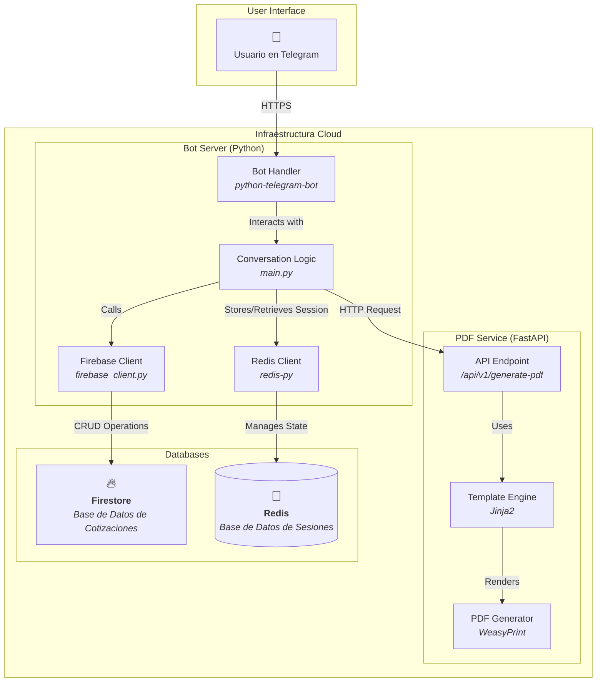
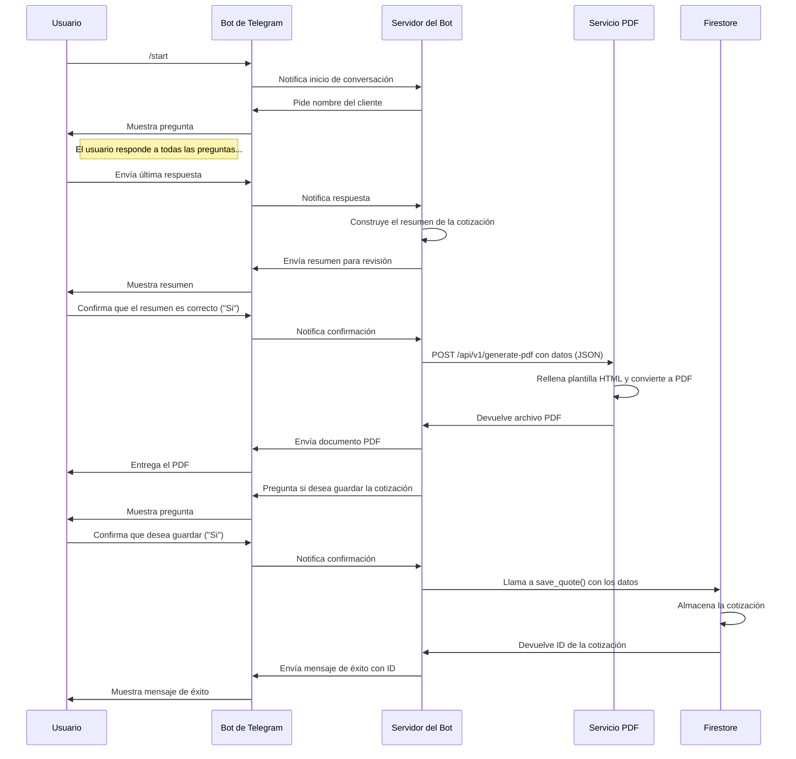

# Conceptualización y Arquitectura: HG Cotizador Bot

---

## Resumen de la Arquitectura

La solución se divide en cuatro componentes principales que trabajan juntos:

1.  **El Bot de Telegram (Interfaz):** La interfaz con la que el usuario interactúa. No requiere desarrollo, solo configuración.
2.  **El Servidor del Bot (Lógica de Negocio):** Un servicio de backend que escucha los mensajes de Telegram, gestiona la conversación (usando Redis para el estado de la sesión) y se comunica con los otros servicios.
3.  **El Servicio de Generación de PDF (Microservicio):** Un microservicio especializado cuya única responsabilidad es recibir datos, rellenar una plantilla y devolver un archivo PDF.
4.  **La Base de Datos (Persistencia):** Una base de datos NoSQL (Google Firestore) que almacena todas las cotizaciones generadas para su consulta y gestión futura.

Separar estos componentes hace que el sistema sea más robusto, escalable y fácil de mantener.

---

## Diagrama de Componentes (Arquitectura Actual)

Este diagrama muestra los componentes clave de la solución y cómo interactúan entre sí.

---

## Diagrama de Flujo de Alto Nivel (Actualizado)

Este diagrama de secuencia muestra el flujo de una conversación completa, desde el inicio hasta la generación del PDF y su almacenamiento en la base de datos.

---

## Flujo de Trabajo Detallado (Paso a Paso)

1.  **Configuración Inicial:**
    *   Registras tu bot en Telegram usando BotFather para obtener un `TOKEN_API`.
    *   Configuras un proyecto en Google Cloud con Firestore y obtienes las credenciales de servicio.
    *   Desarrollas el Servidor del Bot, el Servicio PDF y la plantilla HTML.

2.  **Inicio de la Conversación:**
    *   El usuario envía el comando `/start`.
    *   El `ConversationHandler` del Servidor del Bot se activa y pide el nombre del cliente.

3.  **Recopilación de Datos:**
    *   El bot guía al usuario a través de una serie de preguntas para recopilar los detalles de la cotización (trabajos, materiales, precios, etc.).
    *   El estado de la conversación se mantiene en **Redis** para no perder el hilo si el bot se reinicia.

4.  **Revisión y Edición:**
    *   Al final de las preguntas, el bot presenta un resumen completo.
    *   El usuario puede solicitar la edición de trabajos o materiales si encuentra un error.

5.  **Generación del PDF:**
    *   Una vez que el usuario aprueba el resumen, el Servidor del Bot envía los datos al Servicio PDF.
    *   El Servicio PDF renderiza la plantilla HTML con los datos y la convierte a un archivo PDF.
    *   El PDF se devuelve al Servidor del Bot.

6.  **Entrega y Almacenamiento:**
    *   El Servidor del Bot envía el PDF al usuario a través de Telegram.
    *   Se le pregunta al usuario si desea guardar la cotización.
    *   Si la respuesta es afirmativa, el Servidor del Bot invoca al cliente de **Firestore** para guardar una copia de la cotización en la base de datos, asignándole un ID único.
    *   El bot confirma que la cotización ha sido guardada.