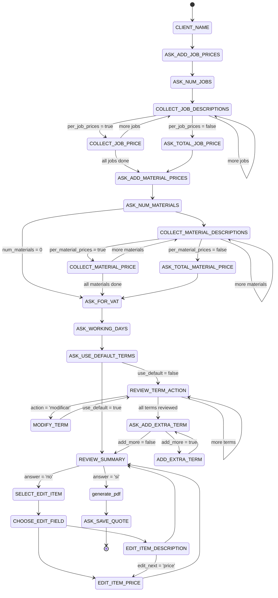

# HG Cotizador Bot

El HG Cotizador Bot es una aplicación que permite a los usuarios generar cotizaciones en formato PDF a través de una interacción conversacional en Telegram. La solución está diseñada con una arquitectura modular, separando la lógica del bot de la generación del documento para mayor robustez y escalabilidad.

## Arquitectura

La aplicación se compone de cuatro componentes principales que trabajan de forma coordinada:

1.  **Bot de Telegram (Interfaz):** La interfaz directa con el usuario. Se configura a través de BotFather y utiliza la API de Telegram para la comunicación.

2.  **Servidor del Bot (Lógica de Negocio):** Un backend en Python que gestiona la conversación con el usuario, interpreta comandos, recopila datos, almacena el estado de la conversación en Redis y orquesta la generación del PDF.

3.  **Servicio de Generación de PDF (Microservicio):** Un microservicio especializado en la creación de documentos PDF a partir de plantillas HTML y datos JSON.

4.  **Base de Datos (Persistencia):** Una base de datos NoSQL (Google Firestore) para almacenar, consultar y gestionar las cotizaciones generadas.

## Características

*   Generación de cotizaciones en PDF mediante un bot de Telegram.
*   Interacción conversacional para la recopilación de datos.
*   Soporte para precios por ítem o totales.
*   Cálculo de IVA opcional.
*   Términos y condiciones personalizables.
*   Resumen de la cotización para revisión antes de generar el PDF.
*   Edición de ítems (trabajos y materiales) después del resumen.
*   Persistencia de cotizaciones en Google Firestore.
*   Comandos para listar, ver, actualizar y eliminar cotizaciones.
*   Arquitectura modular y escalable.

## Tecnologías Utilizadas

### Servidor del Bot
*   **Python**
*   `python-telegram-bot`: Para la interacción con la API de Telegram.
*   `requests`: Para realizar llamadas HTTP al servicio de PDF.
*   `redis`: Para almacenar el estado de la conversación.
*   `google-cloud-firestore`: Para la comunicación con la base de datos.

### Servicio de Generación de PDF
*   **Python**
*   `FastAPI`: Framework web para construir la API REST.
*   `uvicorn`: Servidor ASGI para ejecutar FastAPI.
*   `Jinja2`: Motor de plantillas para renderizar HTML.
*   `WeasyPrint`: Librería para convertir HTML y CSS a PDF.

### Base de Datos
*   **Google Firestore**: Base de datos NoSQL para persistencia de las cotizaciones.

## Diagrama de Estados del Bot (Actualizado)

## TODO

### ✅ Completado

*   **Core:** Flujo conversacional para crear cotizaciones.
*   **Core:** Generación de PDF con `pdf-service`.
*   **Feature:** Soporte para precios por ítem o precios totales.
*   **Feature:** Cálculo de IVA.
*   **Feature:** Personalización de términos y condiciones.
*   **Feature:** Resumen y edición de la cotización antes de la creación del PDF.
*   **Persistence:** Guardar, listar, ver, actualizar y eliminar cotizaciones en Firestore.
*   **Infra:** Configuración mediante `config.ini` y variables de entorno.
*   **Infra:** Almacenamiento de estado de sesión en Redis.
*   **Feature:** Añadido un comando `/help` con la lista de comandos disponibles y su descripción.
*   **Feature:** Definidos los estados de la cotización (`Inicial`, `Enviada`, `Aceptada`, `Rechazada`). El estado por defecto al guardar es `Inicial`.

### ⏳ En Proceso

*   **Feature:** En el handler de /actualizar_cotizacion , se requiere que se cambie,  a /actualizar_cotizacion <ID_cotizacion>, que vaya recorriendo cada uno de los items de los trabajos y de los materiales, y pregunte si se quiere modificar la descripcion o el precio.
 

### Backlog

*   **Feature:** Agregar soporte para múltiples usuarios concurrentes con datos aislados.
*   **Refactor:** Separar la lógica del `ConversationHandler` en módulos más pequeños.
*   **Testing:** Añadir pruebas unitarias y de integración.
*   **Feature:** Mejorar el manejo de errores y la validación de entradas en la conversación.